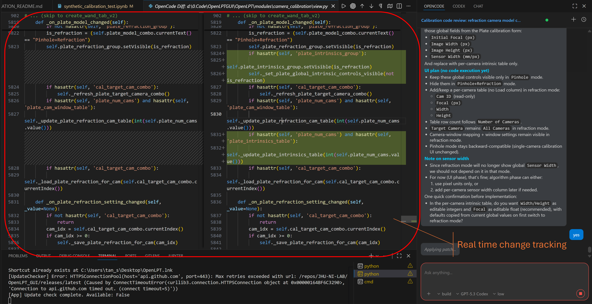
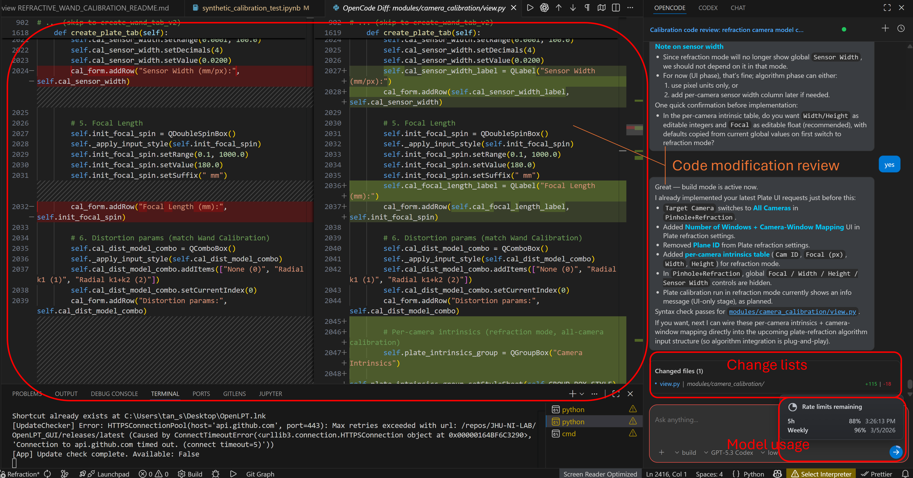
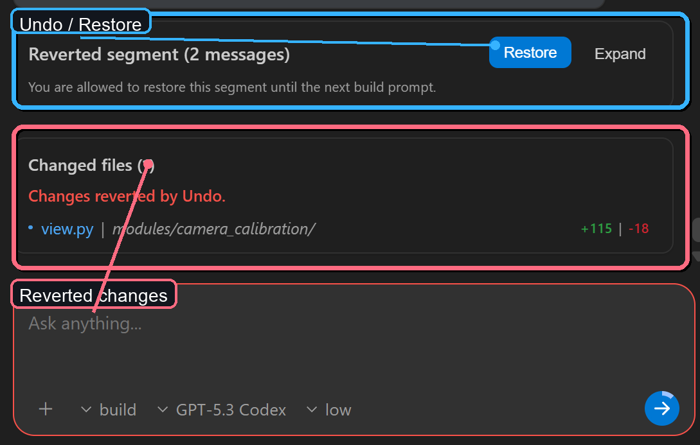

# OpenCode GUI


[](https://marketplace.visualstudio.com/items?itemName=TanShiyong.opencode-gui)
[](https://marketplace.visualstudio.com/items?itemName=TanShiyong.opencode-gui)

OpenCode GUI is a powerful Visual Studio Code extension that brings the capabilities of the OpenCode CLI directly into your editor through a sleek, interactive sidebar.

OpenCode GUI is a VS Code UI for OpenCode CLI focused on real coding workflows rather than chat-only interactions.

- Run OpenCode inside VS Code with a dedicated sidebar UI
- Track subagent execution and todo progress in real time
- Review live code diffs and final change lists
- Safely undo and restore message segments with Git-backed history

If you already use OpenCode CLI and want a stronger in-editor workflow, this extension is built for that use case.

## Preview

<p align="left"><strong>1) Real-Time Change Tracking</strong><br/>Track edits live as the assistant updates code, with side-by-side diffs for immediate review and safer decision-making.</p>

<p align="center">
  
</p>

<p align="left"><strong>2) Change List Summary + Model Usage</strong><br/>Get a concise changed-files summary and model usage visibility in the same flow, so progress and cost stay transparent during long sessions.</p>

<p align="center">
  
</p>

<p align="left"><strong>3) Undo / Restore Workflow</strong><br/>Revert a message segment safely and restore it when needed, with clear segment boundaries and explicit reversible actions.</p>

<p align="center">
  
</p>

## Features

- **Interactive AI Chat**: Communicate with OpenCode directly from the VS Code sidebar.
- **Code Modification**: High-level chat-based code editing and generation.
- **Diff View**: Built-in diff provider to visualize and review changes proposed by the AI before they are applied.
- **Session Management**: Easily create, view, and switch between different chat sessions.
- **Model Selection**: Switch between different AI models and variants supported by OpenCode.
- **File Attachments**: Attach files or images from your clipboard to provide context for your requests.
- **Undo/Redo Support**: Revert or restore changes made during a session with ease.
  + **Undo**: Revert AI-generated changes back to any previous state using Git-powered tracking
  + **Restore**: Restore previously undone changes within the same session
  + **Visual Conflict Resolution**: Review and resolve conflicts when undoing changes
  + **Session History**: Full history of all changes tracked per session

## Installation


### From VS Code Marketplace

[](https://marketplace.visualstudio.com/items?itemName=TanShiyong.opencode-gui)


### Prerequisites

- [OpenCode CLI installation guide](https://opencode.ai/docs#install). After install, ensure `opencode` is available in your `PATH`.
- **Git 2.30.0 or higher** must be installed and available in your `PATH`. The extension uses Git to track and manage code changes.
- VS Code version 1.80.0 or higher.

### PowerShell execution policy restrictions

If you see an error like "running scripts is disabled on this system", use one of these options:

- **Temporary (current terminal session only, recommended first):**
  ```powershell
  Set-ExecutionPolicy -Scope Process -ExecutionPolicy Bypass
  ```

- **Persistent for current user:**
  ```powershell
  Set-ExecutionPolicy -Scope CurrentUser -ExecutionPolicy RemoteSigned
  ```

Then reopen the terminal and retry `opencode --version`.

### Configure `opencode` PATH

If the extension cannot find OpenCode CLI, add the folder that contains `opencode` (or `opencode.exe`) to your `PATH`, then restart VS Code.

- **Windows (PowerShell)**:
  1. Locate the executable path:
     ```powershell
     where opencode
     ```
     Use the parent folder of the returned `opencode.exe` path as your PATH entry.
  2. Add it to User PATH (example):
     ```powershell
     [Environment]::SetEnvironmentVariable(
       "Path",
       $env:Path + ";C:\\path\\to\\opencode\\bin",
       "User"
     )
     ```
  3. Close and reopen VS Code.

- **macOS/Linux**:
  1. Add the OpenCode bin directory to your shell profile (`~/.zshrc`, `~/.bashrc`, etc.):
     ```bash
     export PATH="$PATH:/path/to/opencode/bin"
     ```
  2. Reload shell profile and reopen VS Code.

Tip: In VS Code integrated terminal, run `opencode --version` to verify PATH is correct.

### From VSIX

1. Download the `opencode-gui-0.0.1.vsix` file.
2. In VS Code, open the Extensions view (`Ctrl+Shift+X`).
3. Click on the "..." (Views and More Actions) menu and select "Install from VSIX...".
4. Select the downloaded file and restart VS Code.

## Usage

1. Open the OpenCode sidebar by clicking on the OpenCode icon in the Activity Bar.
2. Use the chat interface to ask questions, request code changes, or explore your project.
3. Review changes in the diff view that automatically opens when OpenCode proposes modifications.
4. Manage your sessions and settings (model, variant, mode) directly in the sidebar.

## Disclaimer

OpenCode GUI is provided "AS IS" without warranty of any kind. Always review changes, run tests, and use version control (Git) before applying or merging AI-generated modifications.

## Server Reuse (Per Workspace)

OpenCode GUI manages the OpenCode background server per workspace using a lock file.

- Lock path: `.opencode/server.lock.json` in the workspace root.
- Stores: workspace-specific `port` and `password`.
- Reuses an existing server when the health check succeeds with Basic Auth.
- If the lock port is occupied by a different server, OpenCode GUI migrates to a new port and updates the lock file.

## Troubleshooting

- If model or variant is not shown after loading the extension, run `Developer: Reload Window` once and wait for initialization to complete.

## How Undo/Restore Works

OpenCode GUI uses Git to track and manage code changes:

1. **Baseline Tracking**: When a session starts, a baseline Git commit is created
2. **Change Recording**: Each AI response is tracked with its own Git commit
3. **Undo**: Reverts workspace files to the baseline commit state
4. **Restore**: Re-applies previously undone changes from history

> **Note**: All changes are stored locally in `.opencode/` directory. No data is sent to external servers for undo functionality.

## Commands

- `OpenCode: Check Version`: Verifies that the OpenCode CLI is correctly installed and accessible.

## Contributing

Contributions are welcome! Please feel free to submit pull requests or open issues on the [GitHub repository](https://github.com/Shiyong-Tan/OpenCodeGUI).

## License

This project is licensed under the MIT License.
